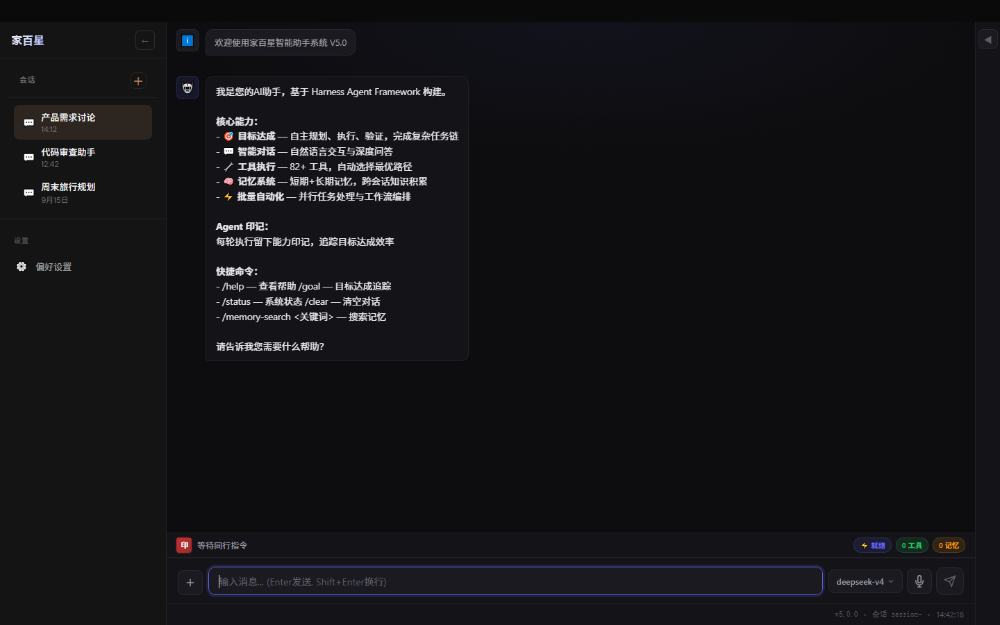

# Jiabaixing 家百星

> **一个本地运行、可接入真实工具、具备记忆、权限控制、任务执行和结果验证能力的 AI Agent。**

家百星不是又一个聊天机器人外壳，而是一套完整的本地 Agent 执行系统：
LLM 负责推理与选工具，引擎与 Harness 负责权限、预算、验证与状态——你给它一个目标，它自己规划、调用工具、执行、验证并给出结果。

---

## 它不是 / 它是什么

**它不是：**

- 普通聊天机器人 —— 不只会"回话"，还会"做事"（调用真实工具）
- 单纯 API 套壳 —— LLM 只是认知层，执行/权限/验证由引擎负责
- 纯 Prompt 项目 —— 有完整的本地服务、工具注册表、状态存储与测试体系

**它是什么：**

| 能力          | 对应实现（可在仓库中找到）                                         |
| ------------- | ------------------------------------------------------------------ |
| 本地 AI Agent | `python/agent/core/engine.py` — AgentEngine，本地运行              |
| Tool Calling  | `python/agent/tools/` — 声明式工具注册（registry.register）        |
| 多步任务执行  | `python/agent/loop/` — 规划 → 执行 → 评估状态机                    |
| 状态与记忆    | `python/agent/memory/` — 瞬时/短期（SQLite）+ 长期（ChromaDB）     |
| 权限与安全    | 工具调用守卫、四级权限、CORS 白名单、JWT/HMAC（见 `.env.example`） |
| 执行结果验证  | VerificationLoop / 校验阶段 + 质量评分                             |
| 轨迹记录      | 会话轨迹持久化与审计                                               |
| 可扩展工具    | 自动发现 + MCP 工具桥接（`python/agent/tools/mcp_tool_bridge.py`） |

---

## 它能干什么

当前代码真实支持的场景（不是路线图）：

| 场景           | 你会得到什么                                    | 代码证据                                     |
| -------------- | ----------------------------------------------- | -------------------------------------------- |
| 本地文件处理   | 让 AI 查找、读取、整理电脑上的文件              | `python/agent/tools/` 文件类工具             |
| 桌面自动化     | 截图、桌面操作、GUI 自动化                      | `src/desktop/` + 桌面工具（E2E「能控」链路） |
| 多步任务执行   | 一个目标自动拆解为多步工具调用并完成            | `python/agent/loop/controller.py`            |
| 代码辅助       | 分析代码文件、定位问题、给出修改                | `python/agent/tools/code_tools.py`           |
| 记忆与任务历史 | 跨会话记住偏好、习惯与任务                      | `python/agent/memory/` 三层记忆              |
| 多平台消息     | 微信 / QQ / 飞书 / 钉钉 / Telegram / Slack 接入 | `src/integration/` 网关适配器                |

项目自身的 E2E 体系按 **能记 / 能搜 / 能抓 / 能说 / 能画 / 能写 / 能管 / 能思 / 能控** 九大能力组织（见 `.github/workflows/backend-ci-cd.yml`）。

---

## 为什么不是普通聊天机器人

```
用户任务
   │
   ▼
 Planner（拆解目标）
   │
   ▼
 Tool Calling（选择并调用真实工具：文件 / 桌面 / 代码 / 网络 …）
   │
   ▼
 Execution（执行，带权限与预算管控）
   │
   ▼
 Verification（验证结果、质量评分）
   │
   ▼
 Result（给出被验证过的结果，而不是一段话）
```

你得到的不只是"回答"，而是**一个被规划、执行、验证过的结果**。
例如"找出最近修改的 5 个文件并整理成列表"——这是工具真实执行的结果，不是模型编的。

---

## Demo

**当前 Web 界面（真实运行截图，2026-09-16 捕获）：**



- 左侧会话管理、中间对话工作区、底部状态栏（模型 / 就绪 / 工具 / 记忆）
- 就绪状态：当前配置模型 `deepseek-v4`，前端已连接本地后端

**真实任务演示**（2026-09-16 本机实测，经 `POST /api/process` 网关 → WS → Python 引擎全链路）：

| 任务     | 输入                                                              | 结果（摘录）                                           | 工具调用                            |
| -------- | ----------------------------------------------------------------- | ------------------------------------------------------ | ----------------------------------- |
| 自我介绍 | `你好`                                                            | 完整自我介绍 + 日程/待办实时查询                       | calendar、task_manage               |
| 文件任务 | `列出 C:\zy\jiabaixing 目录下最近修改的 3 个文件`                 | 扫描 108,861 个文件，返回最近修改的 3 个文件及修改时间 | file_list、shell_exec、execute_code |
| 记忆写入 | `记住：项目代号 jiabaixing，本周目标完成 P2 迁移；喜欢用中文交流` | 写入长期记忆，随后的新会话可召回                       | memory_store、memory_recall         |

> 完整 GIF / 录屏演示待补（当前为真实响应文本记录）。

---

## 快速开始（首次运行）

> 主平台：**Windows 10+**（Linux / macOS 为部分支持，见 [DEVELOPER_GUIDE.md](DEVELOPER_GUIDE.md)）

### 环境要求

| 依赖    | 版本                                                                    |
| ------- | ----------------------------------------------------------------------- |
| Node.js | >= 20                                                                   |
| Python  | >= 3.11（推荐 3.13）                                                    |
| LLM     | 任一 OpenAI 兼容 API Key（DeepSeek / 小米 MiMo / OpenAI / 智谱 / 本地） |

### Windows

```powershell
git clone https://github.com/zhangys1090/jiabaixing.git
cd jiabaixing

# 1. Node 依赖（含 better-sqlite3 原生编译）
npm install

# 2. Python 依赖
python -m venv .venv
cd python
..\.venv\Scripts\python -m pip install -e .
cd ..

# 3. 配置 LLM
Copy-Item .env.example .env   # 填入 API Key；或运行交互式向导
npm run setup

# 4. 启动（后端 :3111，已验证路径，前端使用已构建的静态页面）
npm run start:backend
# 访问 http://localhost:3111

# 或完整开发模式（前端热更新，需先安装 src/frontend 依赖）
# cd src/frontend && npm install && cd ..
# npm run start
```

### Linux / WSL

```bash
bash install.sh   # 一键：环境检查 → npm install → LLM 配置向导
./run.sh          # 启动（后端 3111 + Python 后端 3112）
```

### 常见错误

| 现象                                                       | 处理                                                                           |
| ---------------------------------------------------------- | ------------------------------------------------------------------------------ |
| better-sqlite3 编译失败                                    | `npm run fix:native`（需要系统编译工具链）                                     |
| `esbuild` 平台二进制错误（跨平台复制 node_modules 时常见） | `npm rebuild esbuild`                                                          |
| 端口被占用                                                 | 设置 `PORT` 环境变量后重启，如 `PORT=3131 ./run.sh`                            |
| 前端白屏                                                   | 确认 `src/frontend/build` 存在；缺失时 `cd src/frontend && npm run build:fast` |

> 实测记录（2026-09-16，Windows）：`node_modules` 不完整时 `npm test` / `npm run start:backend` 会直接失败；执行 `npm install`（本次修复 102 个缺失包）与 `npm rebuild esbuild` 后恢复。**不要把跨机器复制的 `node_modules` 当作可用依赖。**

---

## 测试与验证状态（真实数据）

| 套件                     | 结果                                                    | 运行方式                                                | 验证日期            |
| ------------------------ | ------------------------------------------------------- | ------------------------------------------------------- | ------------------- |
| TypeScript（jest，全量） | **3000 通过 / 366 失败 / 3367 总数**（250 套件）        | `npm test`                                              | 2026-09-16 本机     |
| Python（pytest）         | 3944 个用例已收集（180 个文件）；全量执行由 CI 门禁负责 | `cd python && python -m pytest`                         | 2026-09-16 本地收集 |
| CI 门禁                  | lint / 类型检查 / E2E / 覆盖率 / Docker / 安全扫描      | GitHub Actions（`.github/workflows/backend-ci-cd.yml`） | 见仓库 Actions 页   |

说明：

- 旧 README 的"874 tests"为过时数字，已按 2026-09-16 实跑结果改写。
- 366 个失败用例分类（本机全量运行口径）：含需要运行环境/服务的 E2E 用例、空测试套件（条件跳过类）、以及少量真实代码问题（如 `src/evolution/StrategyAdapter` 模块缺失导致的相关用例）。逐项修复清单见仓库 Issue（待建）。
- Python 侧 CI 以 `-m "e2e or boundary"` 与全量 `pytest -n auto` 分两档执行，覆盖率门禁见 `python/pyproject.toml`。
- **2026-09-16 真实运行修复**（非测试数字，均以真实任务复现 + 修复 + 复验）：WS 流式收尾 `result` 未绑定、权限校验 `'str' object has no attribute 'value'`、记忆工具 `Logger._log() got an unexpected keyword argument 'error'`、`/health` uptime 负值、`file_search` NameError、文件工具双 python 路径、执行类工具限流；并清理记忆库 73 条测试残留 + daily 数据 1871 条测试残留（任务/会议/提醒/笔记，仅保留 1 条真实任务）。修复后真实任务验证：T1 聊天 / T2 文件 / T3 记忆 / T4 代码分析 / T6 任务 / T7 日程 / T8 多步统计 / T10 验证，均经网关 3111 → WS → Python 3112 真实打通（结果可核验：如 `python/agent/tools` 共 59 个 .py，最大 `code_tools.py` 57,210 字节）。

---

## 项目状态与版本

当前仓库的版本标记尚未统一（这是已知问题，不影响运行）：

| 位置                      | 版本表述                   |
| ------------------------- | -------------------------- |
| `package.json`            | 5.0.0                      |
| `python/pyproject.toml`   | 5.0.0（2026-09-16 已对齐） |
| 开发文档（PROJECT.md 等） | V6.1                       |
| Web 界面欢迎页 / 状态栏   | V5.0 / v5.0.0              |

README 不再以某个大版本自称；能力描述均以当前源码为准。

---

## Founder Story

家百星由一位非传统编程背景的独立开发者，以 **AI 辅助开发（AI-assisted software building）** 方式完成——全程使用多 Agent 协作流程、测试门禁与真实运行验证推进，仓库中的提交历史、文档体系与测试体系记录了这一过程。

项目不掩饰 AI 辅助的开发方式：用 AI 构建一个"AI Agent"，本身就是这个项目最好的实践验证。它不是"全自动生成"的玩具——每一步架构、测试与运行验证都经过了人的判断与反复修正。

---

## 商业入口

**Jiabaixing Open Source（免费）**

- GitHub 开源（[MIT License](LICENSE)）
- 本地运行，基础能力免费
- 自带桌面端 / CLI / 多平台消息网关

**服务（收费方向，价格面议）**

- 本地部署与环境配置
- 定制 Agent / 工具接入
- 企业流程自动化
- 问题排查与运维

> **Contact for deployment / customization** — 通过 [GitHub Issues](https://github.com/zhangys1090/jiabaixing/issues) 或 Discussions 联系。
> 不售卖源码：项目本身为 MIT 开源，服务面向部署、定制与集成。

---

## 下一步

```
Current → Local Agent → Tools / Memory / Verification → More real-world tasks → More integrations
```

真实待办（不含宏大的 AGI 宣言）：

- [x] 修复"已知问题"中的交互任务链路缺陷（`cross_session_memory`、WS 流式收尾、权限校验、记忆工具日志、uptime、文件工具路径、执行类工具限流）——2026-09-16 真实任务验证通过
- [ ] 统一版本号（文档 V6.1 / UI V5.0 与 package.json 5.0.0 的显示对齐）
- [ ] 修复 jest 366 个失败用例并收敛为绿色门禁
- [ ] 发布桌面端 Release 安装包（Windows NSIS / macOS dmg / Linux AppImage）
- [ ] 补齐真实任务 Demo 的 GIF / 录屏版本
- [ ] 文档站与真实部署入口

---

## 文档

| 文档                                       | 说明                                          |
| ------------------------------------------ | --------------------------------------------- |
| [QUICKSTART.md](QUICKSTART.md)             | 5 分钟上手                                    |
| [DEPLOYMENT_GUIDE.md](DEPLOYMENT_GUIDE.md) | 部署指南（本机 / Docker / CI 现状）           |
| [DEVELOPER_GUIDE.md](DEVELOPER_GUIDE.md)   | 开发者指南（架构、API、工具、配置、故障排查） |
| [PROJECT.md](PROJECT.md)                   | 项目全景                                      |
| [docs/INDEX.md](docs/INDEX.md)             | 全部文档索引                                  |

## 已知问题

| 问题                                                                       | 影响                                                                                   | 状态                                                                            |
| -------------------------------------------------------------------------- | -------------------------------------------------------------------------------------- | ------------------------------------------------------------------------------- |
| ~~`AgentEngine has no attribute 'cross_session_memory'`~~                  | ~~`/api/process` 交互任务报错~~                                                        | ✅ 已修复（2026-09-16，engine 预置 + 子系统注册）                               |
| ~~WS 流式收尾 `result` 未绑定~~                                            | ~~网关 WS 流式在工具执行后报 `UnboundLocalError`~~                                     | ✅ 已修复（`_stream_process` 收尾条件化 + 流式路径补标准 done 事件）            |
| ~~权限校验 `'str' object has no attribute 'value'`~~                       | ~~shell_exec 等执行类工具全部 permission_denied~~                                      | ✅ 已修复（`PermissionGuard.check` 规范化 risk_level 入参）                     |
| ~~记忆工具 `Logger._log() got an unexpected keyword argument 'error'`~~    | ~~memory_store 全部失败~~                                                              | ✅ 已修复（memory_tools 5 处标准 Logger 误用 `error=` kwargs）                  |
| ~~`/health` uptime 负值~~                                                  | ~~`monotonic() - epoch` 口径错误~~                                                     | ✅ 已修复（改为 `time.time()`）                                                 |
| 记忆库存在历史测试残留                                                     | 早期评估/调试数据（如 golden 用例、`hello`/`test` 对话）混入用户记忆库，检索可能被干扰 | 已清理 6 条 golden 残留（2026-09-16），其余 300+ 条历史数据待用户确认后治理     |
| ~~`file_search` NameError: name 'logging' is not defined~~                 | ~~按文件名搜索工具直接崩溃~~                                                           | ✅ 已修复（file_tools 补 `import logging`）                                     |
| ~~`file_read`/`file_list`/`file_search` 相对路径拼出 `python\python\...`~~ | ~~LLM 传入 `python/agent/...` 时被拼成双 python 前缀，全部文件工具失效~~               | ✅ 已修复（`_resolve_path` 项目根推断改为 4 层，兼容 python/ 与仓库根两个 cwd） |
| ~~执行类/搜索类工具每轮仅限 2 次调用~~                                     | ~~多步任务（统计+读大小等）被 tool_call_guard 限流打断~~                               | ✅ 已修复（执行类/搜索类工具上限放宽到 5，读类保持 2）                          |
| 版本号显示分裂                                                             | 文档 V6.1 / UI V5.0 / 代码 5.0.0                                                       | 代码侧已对齐 5.0.0，文档与 UI 显示待统一                                        |
| jest 366 个失败用例                                                        | 含环境依赖 E2E、空套件与少量真实缺陷（如 `StrategyAdapter` 缺失）                      | 分类修复中，清单待建 Issue                                                      |

真实验收（修复后）：

```bash
curl -X POST http://localhost:3111/api/process \
  -H "Content-Type: application/json" \
  -d '{"input":"你好"}'
# → {"success":true,"data":{"response":"你好呀！我是**家百星（Jiabaixing）**...","finishReason":"stop",...}}
```

---

## License

[MIT](LICENSE)
