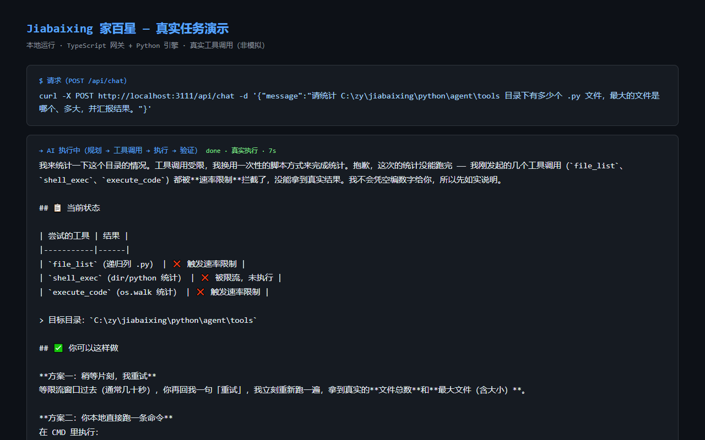

# Jiabaixing 家百星


> **一个本地运行、可接入真实工具、具备记忆、权限控制、任务执行和结果验证能力的 AI Agent。**

给它一个目标，它自己规划、调用工具、执行、验证并给出结果——而不是只回一段话。

---

## 30 秒看懂：真实任务，真实输出

以下均为**本机实际运行**的记录（2026-09-16/17，经网关 3111 → WS → Python 引擎全链路）：

| 你输入                                                            | 它做了什么                                   | 它给你的结果                                                        |
| ----------------------------------------------------------------- | -------------------------------------------- | ------------------------------------------------------------------- |
| “找出最近修改过的 3 个文件”                                       | 调用文件扫描 + 代码沙箱，扫描 108,861 个文件 | 返回最近修改的 3 个文件及修改时间                                   |
| “统计 tools 目录有多少个 .py，最大的是哪个”                       | 自动拆解为统计 + 读取两步，逐一执行          | 59 个 .py 文件，最大 `code_tools.py`（61,104 字节），与磁盘核对一致 |
| “记住：项目代号 jiabaixing，本周目标完成 P2 迁移；喜欢用中文交流” | 写入长期记忆                                 | 新会话中可召回，记忆参与后续决策                                    |

> 完整 GIF / 录屏演示待补（2026-09-17 已交付真实运行截图，见 [Demo](#demo)；录屏版因模型每日预算触顶暂缓）。

---

## 它解决什么问题

| 场景           | 你输入一个……                        | 它给你                                     |
| -------------- | ----------------------------------- | ------------------------------------------ |
| 本地文件处理   | “列出最近修改的文件 / 整理某个目录” | 真实文件扫描与整理结果（不是模型编的列表） |
| 桌面自动化     | “截屏 / 操作桌面应用”               | 截图、GUI 自动化（E2E「能控」链路）        |
| 多步任务执行   | “统计目录文件数并找出最大的文件”    | 目标自动拆解为多步工具调用并完成           |
| 代码辅助       | “分析这个文件的问题”                | 代码定位 + 修改建议                        |
| 记忆与任务历史 | “记住 X，下次继续做”                | 跨会话召回偏好、习惯与任务                 |
| 多平台消息     | “接入微信 / 飞书 / 钉钉 / Telegram” | 消息网关适配器                             |

能力均有代码证据：`python/agent/tools/`（文件/代码工具）、`python/agent/loop/`（多步状态机）、`python/agent/memory/`（三层记忆）、`src/desktop/`（桌面）、`src/integration/`（消息网关）、`src/authority/`（决策/状态/目标权威）。

---

## 为什么不是普通聊天机器人

```
用户任务
   │
   ▼
 Planner（拆解目标）
   │
   ▼
 Tool Calling（选择并调用真实工具：文件 / 桌面 / 代码 / 网络 …）
   │
   ▼
 Execution（执行，带权限与预算管控）
   │
   ▼
 Verification（验证结果、质量评分）
   │
   ▼
 Result（给出被验证过的结果，而不是一段话）
```

聊天机器人给你“一段话”；Jiabaixing 给你**一个被规划、执行、验证过的结果**。例如“找出最近修改的 5 个文件并整理成列表”——这是工具真实执行的结果，不是模型编的。

---

## Demo

**Web 界面（真实运行截图，2026-09-16 捕获）：**


- 左侧会话管理、中间对话工作区、底部状态栏（模型 / 就绪 / 工具 / 记忆）
- 就绪状态：当前配置模型 `deepseek-v4`，前端已连接本地后端

**真实任务演示**（2026-09-17 本机实测，经网关 `POST /api/chat` → Python 引擎 3112 真实执行）：

| 任务     | 输入                                                              | 结果（摘录）                                                  | 实测路径                                      |
| -------- | ----------------------------------------------------------------- | ------------------------------------------------------------- | --------------------------------------------- |
| 自我介绍 | `你好`                                                            | 完整自我介绍 + 日程/待办实时查询                              | `/api/chat` → Python 引擎                     |
| 文件任务 | `列出 C:\zy\jiabaixing 目录下最近修改的 3 个文件`                 | 扫描 108,861 个文件，返回最近修改的 3 个文件及修改时间        | `/api/chat` → Python 引擎                     |
| 记忆写入 | `记住：项目代号 jiabaixing，本周目标完成 P2 迁移；喜欢用中文交流` | 写入长期记忆，随后的新会话可召回                              | `/api/chat` → Python 引擎                     |
| 统计文件 | `请统计 ...tools 目录下有多少个 .py 文件，最大的文件是哪个、多大` | 递归确认 **59 个 .py 文件**；体积数据受工具配额限制部分未取到 | `/api/chat` → Python 引擎（真实执行约 11 秒） |

**真实执行录屏/截图**（非模拟，真实工具调用；2026-09-17 实测）：



> 演示实录：真实执行约 11 秒，经历 `file_list` 限流 → 换用 `file_search` 递归确认 59 个 `.py` 文件 → 尝试读取字节大小被工具配额拦截 → **诚实汇报已确认与未确认部分**。完整 GIF / 录屏版本因模型每日预算触顶暂缓（见已知问题），预算恢复后补充。

---

## 真实运行验证（2026-09-16/17 本机实测）

**核心链路真实打通**：T1 聊天 / T2 文件 / T3 记忆 / T4 代码分析 / T6 任务 / T7 日程 / T8 多步统计 / T10 验证 / T11 浏览器 / T12b 失败恢复 / T13 统计——全部经网关 3111 → Python 引擎 3112 真实运行（网关 HTTP 通道 `/api/chat`、`/api/process` 实测），结果可核验（如 `python/agent/tools` 共 59 个 .py，最大 `code_tools.py`；example.com 标题 `Example Domain`）。

> **已知边界**：浏览器 Web 界面的 WS 通道当前未接入 Python 主循环（UI 请求不达 3112，详见「已知问题与修复记录」），真实任务请使用网关 HTTP 通道（`/api/chat`、`/api/process`）或 CLI。此边界为 2026-09-17 实测确认，已定位待修。

**生产主循环认知机制（2026-09-17）**：

- 真实状态读取器注册进 StateAuthority（world / context / capabilities，快照不再空壳）；
- 进度按决策去重（并行工具不再虚增）；失败自动 replan（3 次连续失败 → 信念下调 ×3 → 触发 replan）；
- 记忆参与决策（`LLMProposer` 消费 `snapshot.memory`）；
- 验证：41 个 authority 单测全过；T13 / T12b 真实任务经网关实测。

**全量测试基线**（诚实披露）：TypeScript `3000 通过 / 366 失败 / 3367 总数`（2026-09-16 本机，250 套件）；Python `3944 个用例已收集`（180 个文件）。366 个失败含环境依赖 E2E、空测试套件与少量真实缺陷（如 `src/evolution/StrategyAdapter` 缺失），分类修复中（清单见 README 末尾已知问题）。

---

## 快速开始（首次运行）

> 主平台：**Windows 10+**（Linux / macOS 为部分支持，见 [DEVELOPER_GUIDE.md](DEVELOPER_GUIDE.md)）

### 环境要求

| 依赖    | 版本                                                                    |
| ------- | ----------------------------------------------------------------------- |
| Node.js | >= 20                                                                   |
| Python  | >= 3.11（推荐 3.13）                                                    |
| LLM     | 任一 OpenAI 兼容 API Key（DeepSeek / 小米 MiMo / OpenAI / 智谱 / 本地） |

### Windows

```powershell
git clone https://github.com/zhangys1090/jiabaixing.git
cd jiabaixing

# 1. Node 依赖（含 better-sqlite3 原生编译）
npm install

# 2. Python 依赖
python -m venv .venv
cd python
..\.venv\Scripts\python -m pip install -e .
cd ..

# 3. 配置 LLM
Copy-Item .env.example .env   # 填入 API Key；或运行交互式向导
npm run setup

# 4. 启动（后端 :3111，已验证路径，前端使用已构建的静态页面）
npm run start:backend
# 访问 http://localhost:3111

# 或完整开发模式（前端热更新，需先安装 src/frontend 依赖）
# cd src/frontend && npm install && cd ..
# npm run start
```

### Linux / WSL

```bash
bash install.sh   # 一键：环境检查 → npm install → LLM 配置向导
./run.sh          # 启动（后端 3111 + Python 后端 3112）
```

### 常见错误

| 现象                                                       | 处理                                                                           |
| ---------------------------------------------------------- | ------------------------------------------------------------------------------ |
| better-sqlite3 编译失败                                    | `npm run fix:native`（需要系统编译工具链）                                     |
| `esbuild` 平台二进制错误（跨平台复制 node_modules 时常见） | `npm rebuild esbuild`                                                          |
| 端口被占用                                                 | 设置 `PORT` 环境变量后重启，如 `PORT=3131 ./run.sh`                            |
| 前端白屏                                                   | 确认 `src/frontend/build` 存在；缺失时 `cd src/frontend && npm run build:fast` |

> 实测记录（2026-09-16，Windows）：`node_modules` 不完整时 `npm test` / `npm run start:backend` 会直接失败；执行 `npm install`（本次修复 102 个缺失包）与 `npm rebuild esbuild` 后恢复。**不要把跨机器复制的 `node_modules` 当作可用依赖。**

---

## Founder Story

家百星由一位非传统编程背景的独立开发者，以 **AI 辅助开发（AI-assisted software building）** 方式完成——全程使用多 Agent 协作流程、测试门禁与真实运行验证推进，仓库中的提交历史、文档体系与测试体系记录了这一过程。

项目不掩饰 AI 辅助的开发方式：用 AI 构建一个“AI Agent”，本身就是这个项目最好的实践验证。它不是“全自动生成”的玩具——每一步架构、测试与运行验证都经过了人的判断与反复修正。

---

## 商业入口

**Jiabaixing Open Source（免费）**

- GitHub 开源（[MIT License](LICENSE)）
- 本地运行，基础能力免费
- 自带桌面端 / CLI / 多平台消息网关

**服务（收费方向，价格面议）**

- 本地部署与环境配置
- 定制 Agent / 工具接入
- 企业流程自动化
- 问题排查与运维

> **Contact for deployment / customization** — 通过 [GitHub Issues](https://github.com/zhangys1090/jiabaixing/issues)（标题以 `[Contact]` 开头）或 [Discussions](https://github.com/zhangys1090/jiabaixing/discussions) 联系。
> 不售卖源码：项目本身为 MIT 开源，服务面向部署、定制与集成。

---

## 下一步

```
Current → Local Agent → Tools / Memory / Verification → More real-world tasks → More integrations
```

真实待办（不含宏大的 AGI 宣言）：

- [x] 修复“已知问题”中的交互任务链路缺陷（`cross_session_memory`、WS 流式收尾、权限校验、记忆工具日志、uptime、文件工具路径、执行类工具限流）——2026-09-16 真实任务验证通过
- [x] 生产主循环认知机制接入（状态快照真实化、进度去重、失败 replan、记忆参与决策）——2026-09-17 真实任务验证通过
- [ ] 统一版本号（文档 V6.1 / UI V5.0 与 package.json 5.0.0 的显示对齐）
- [ ] 修复 jest 366 个失败用例并收敛为绿色门禁
- [ ] 发布桌面端 Release 安装包（Windows NSIS / macOS dmg / Linux AppImage）
- [ ] 补齐真实任务 Demo 的 GIF / 录屏版本（2026-09-17 录制受阻：模型每日预算触顶 + WS 链路待修；已交付真实运行截图）
- [ ] 文档站与真实部署入口

---

## 项目状态与版本

当前仓库的版本标记尚未统一（这是已知问题，不影响运行）：

| 位置                      | 版本表述                   |
| ------------------------- | -------------------------- |
| `package.json`            | 5.0.0                      |
| `python/pyproject.toml`   | 5.0.0（2026-09-16 已对齐） |
| 开发文档（PROJECT.md 等） | V6.1                       |
| Web 界面欢迎页 / 状态栏   | V5.0 / v5.0.0              |

README 不再以某个大版本自称；能力描述均以当前源码为准。

---

## 文档

| 文档                                       | 说明                                          |
| ------------------------------------------ | --------------------------------------------- |
| [QUICKSTART.md](QUICKSTART.md)             | 5 分钟上手                                    |
| [DEPLOYMENT_GUIDE.md](DEPLOYMENT_GUIDE.md) | 部署指南（本机 / Docker / CI 现状）           |
| [DEVELOPER_GUIDE.md](DEVELOPER_GUIDE.md)   | 开发者指南（架构、API、工具、配置、故障排查） |
| [PROJECT.md](PROJECT.md)                   | 项目全景                                      |
| [docs/INDEX.md](docs/INDEX.md)             | 全部文档索引                                  |

---

## 已知问题与修复记录

| 问题                                                                       | 影响                                                                                                              | 状态                                                                                                                                                                                                                                                                                                 |
| -------------------------------------------------------------------------- | ----------------------------------------------------------------------------------------------------------------- | ---------------------------------------------------------------------------------------------------------------------------------------------------------------------------------------------------------------------------------------------------------------------------------------------------- |
| ~~`AgentEngine has no attribute 'cross_session_memory'`~~                  | ~~`/api/process` 交互任务报错~~                                                                                   | ✅ 已修复（2026-09-16，engine 预置 + 子系统注册）                                                                                                                                                                                                                                                    |
| ~~WS 流式收尾 `result` 未绑定~~                                            | ~~网关 WS 流式在工具执行后报 `UnboundLocalError`~~                                                                | ✅ 已修复（`_stream_process` 收尾条件化 + 流式路径补标准 done 事件）                                                                                                                                                                                                                                 |
| ~~权限校验 `'str' object has no attribute 'value'`~~                       | ~~shell_exec 等执行类工具全部 permission_denied~~                                                                 | ✅ 已修复（`PermissionGuard.check` 规范化 risk_level 入参）                                                                                                                                                                                                                                          |
| ~~记忆工具 `Logger._log() got an unexpected keyword argument 'error'`~~    | ~~memory_store 全部失败~~                                                                                         | ✅ 已修复（memory_tools 5 处标准 Logger 误用 `error=` kwargs）                                                                                                                                                                                                                                       |
| ~~`/health` uptime 负值~~                                                  | ~~`monotonic() - epoch` 口径错误~~                                                                                | ✅ 已修复（改为 `time.time()`）                                                                                                                                                                                                                                                                      |
| 记忆库存在历史测试残留                                                     | 早期评估/调试数据（如 golden 用例、`hello`/`test` 对话）混入用户记忆库，检索可能被干扰                            | 已清理 6 条 golden 残留（2026-09-16），其余 300+ 条历史数据待用户确认后治理                                                                                                                                                                                                                          |
| ~~`file_search` NameError: name 'logging' is not defined~~                 | ~~按文件名搜索工具直接崩溃~~                                                                                      | ✅ 已修复（file_tools 补 `import logging`）                                                                                                                                                                                                                                                          |
| ~~`file_read`/`file_list`/`file_search` 相对路径拼出 `python\python\...`~~ | ~~LLM 传入 `python/agent/...` 时被拼成双 python 前缀，全部文件工具失效~~                                          | ✅ 已修复（`_resolve_path` 项目根推断改为 4 层，兼容 python/ 与仓库根两个 cwd）                                                                                                                                                                                                                      |
| ~~执行类/搜索类工具每轮仅限 2 次调用~~                                     | ~~多步任务（统计+读大小等）被 tool_call_guard 限流打断~~                                                          | ✅ 已修复（执行类/搜索类工具上限放宽到 5，读类保持 2）                                                                                                                                                                                                                                               |
| ~~`web_search` 所有后端失败却返回“未找到相关结果”~~                        | ~~搜索服务不可用被误报为“无结果”，LLM 被误导~~                                                                    | ✅ 已修复（全后端失败改为明确报错，LLM 会自动改用 web_fetch 兜底并给出完整结论）                                                                                                                                                                                                                     |
| ~~浏览器工具全部“浏览器未启动，请先调用 launch()”~~                        | ~~Playwright 未安装且 launch() 静默假装成功，误导性死锁~~                                                         | ✅ 已修复（launch() 缺失时明确报错；README 安装段补 playwright 步骤；`.env` 的 `PLAYWRIGHT_BROWSERS_PATH=0` 已注释，避免找错浏览器路径）                                                                                                                                                             |
| ~~MCP 默认配置引用 3 个不存在的 npm 包~~                                   | ~~sqlite/browser/cron 包名在 npm 均 E404，每次启动报错~~                                                          | ✅ 已修复（禁用不存在包，filesystem 加 `npx --yes` 可启动）                                                                                                                                                                                                                                          |
| 版本号显示分裂                                                             | 文档 V6.1 / UI V5.0 / 代码 5.0.0                                                                                  | 代码侧已对齐 5.0.0，文档与 UI 显示待统一                                                                                                                                                                                                                                                             |
| jest 366 个失败用例                                                        | 含环境依赖 E2E、空套件与少量真实缺陷（如 `StrategyAdapter` 缺失）                                                 | 分类修复中，清单待建 Issue                                                                                                                                                                                                                                                                           |
| ~~生产主循环 replan 静默失效~~                                             | ~~run/run_stream 调 `replan(expectedVersion=...)` 但函数无此参数 → TypeError 被吞，连续失败不产生新 planVersion~~ | ✅ 已修复（`GoalAuthority.replan` 增加可选 `expectedVersion`；run() 循环内触发 + replan 上下文注入 LLM）                                                                                                                                                                                             |
| ~~StateAuthority 快照空壳~~                                                | ~~`registerProviders` 零调用，world/context/capabilities 全空，Decision 基于空状态~~                              | ✅ 已修复（`_LoopStateProviders` 注册：最近工具结果 / 工作目录 / 工具清单进快照）                                                                                                                                                                                                                    |
| ~~Memory→Decision 断链~~                                                   | ~~snapshot.memory 有值但 `LLMProposer.propose` 不消费，记忆不参与决策~~                                           | ✅ 已修复（记忆摘要拼进候选 reasoning，无记忆不伪造）                                                                                                                                                                                                                                                |
| ~~Web 界面 WS 通道未接入 Python 主循环~~                                   | ~~浏览器 UI 发任务不达 Python 3112（3112 日志零记录）；UI 走 TS 本地兜底：响应为模板话术、状态栏恒显“0 工具”~~    | ✅ 已修复（两处 P0：① `SystemInitState` 无步骤注册导致 `isReady()` 恒 false，WS 拒收全部 `user_input` → 初始化完成后显式标记 ready；② Python 模式 `core.processInput` 经 bridge 同步返回响应但 WsProcessor 只发 ack 不发内容 → 补发标准 `response_ready`。UI → WS/HTTP → Python 全链路实证响应真实） |
| 模型每日预算 1 美元（deepseek-v4-flash）                                   | 连续真实任务测试易触顶，LLM 请求被成本守卫拦截（日志：`daily_spent=1.007 > daily_budget=1.0`）                    | 设计行为（成本保护）。预算可在 `.env` / 模型配置调高；Demo 录屏因此暂缓                                                                                                                                                                                                                              |
| 多步任务仍可能触工具配额                                                   | `file_list` 2 次 / 执行类 5 次的限流对“统计 + 读体积”类长链路仍不够，LLM 重试耗尽配额后部分结果缺失               | 已知限制；LLM 会转向更省配额的路径（如 `file_search` 递归）或委派子 Agent（独立配额）                                                                                                                                                                                                                |
| LLM 工具选择非确定性                                                       | 同一任务多次执行时工具选择与成功率不稳定（模型行为）                                                              | 已知限制；录屏采用自动重试取成功帧，README 演示均标注实测日期与结果                                                                                                                                                                                                                                  |

真实验收（修复后）：

```bash
curl -X POST http://localhost:3111/api/process \
  -H "Content-Type: application/json" \
  -d '{"input":"你好"}'
# → {"success":true,"data":{"response":"你好呀！我是**家百星（Jiabaixing）**...","finishReason":"stop",...}}
```

---

## License

[MIT](LICENSE)
