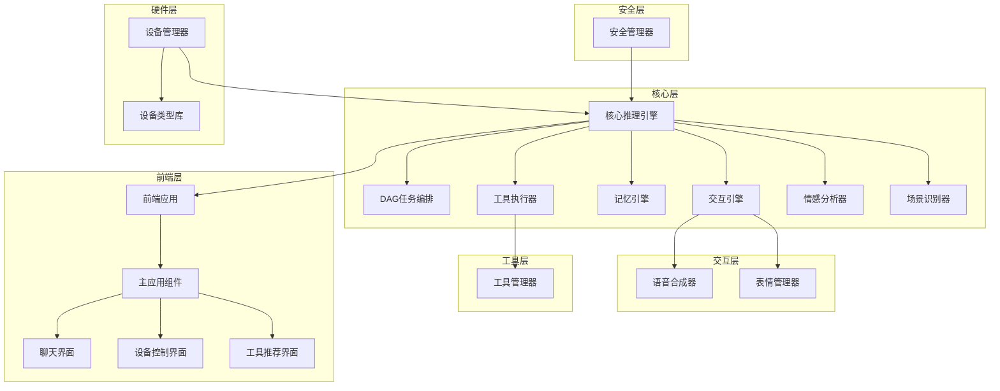

# 模块依赖关系图

## 核心模块依赖关系

## 详细依赖关系

### 核心推理引擎 (CoreReasoningEngine)
- **依赖**: 记忆引擎、交互引擎、工具执行器、情感分析器、场景识别器
- **被依赖**: 前端应用

### 记忆引擎 (MemoryEngine)
- **依赖**: 无
- **被依赖**: 核心推理引擎

### 交互引擎 (InteractionEngine)
- **依赖**: 语音合成器、表情管理器
- **被依赖**: 核心推理引擎

### 工具执行器 (ToolExecutor)
- **依赖**: 工具管理器
- **被依赖**: 核心推理引擎

### 设备管理器 (DeviceManager)
- **依赖**: 设备类型库
- **被依赖**: 核心推理引擎

### 安全管理器 (SecurityManager)
- **依赖**: 无
- **被依赖**: 核心推理引擎

### 前端应用 (Frontend)
- **依赖**: 核心推理引擎
- **被依赖**: 无
